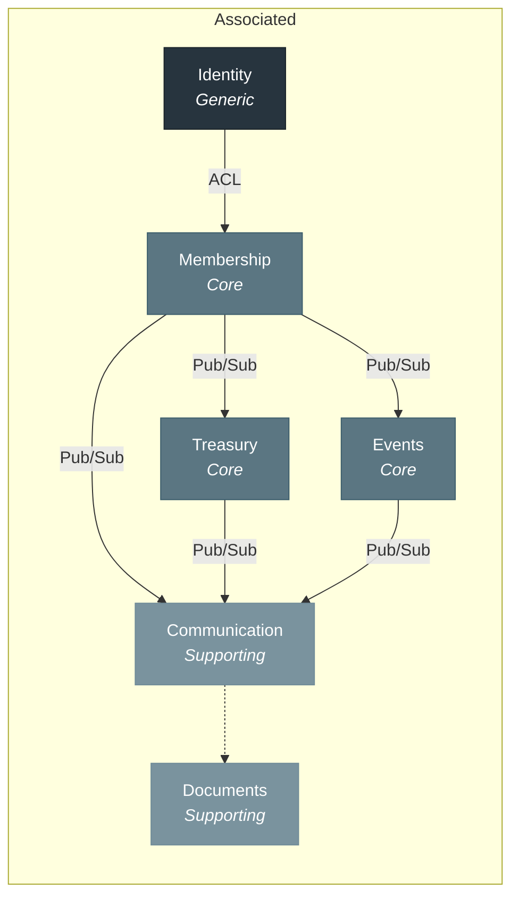
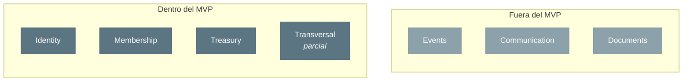
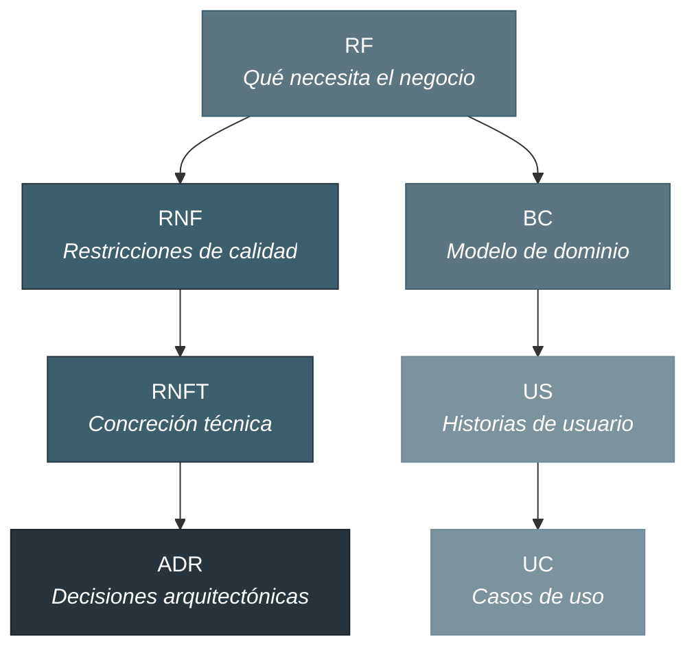
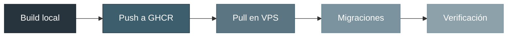

<p align="center">
  
</p>

# Associated

**Gestión para colectividades**


---

## Tabla de contenidos

- [Qué es Associated](#qué-es-associated)
- [El problema](#el-problema)
- [Para quién es Associated](#para-quién-es-associated)
- [Lo que Associated no es](#lo-que-associated-no-es)
- [Stack tecnológico](#stack-tecnológico)
- [Arquitectura](#arquitectura)
- [Alcance del MVP](#alcance-del-mvp)
- [Marca](#marca)
- [Especificación](#especificación)
- [Estructura del proyecto](#estructura-del-proyecto)
- [Inicio rápido](#inicio-rápido)
- [Despliegue](#despliegue)
- [Licencia](#licencia)

---

## Qué es Associated

> _"Cuando llegué a tesorero de la peña, me encontré con siete versiones diferentes del listado de socios."_

Esa frase, recogida en entrevistas reales con voluntarios de colectividades en Aragón, resume un problema que comparten más de 300.000 asociaciones, peñas, clubes y cofradías en España. La gestión diaria recae en personas que dedican su tiempo libre a la comunidad y que, a cambio, heredan carpetas de Excel sin documentar, grupos de WhatsApp como canal oficial y cuadernos de contabilidad que solo entiende quien los escribió.

Associated es el ERP diseñado para que gestionar tu colectividad sea una tarea asumible, no un sacrificio. Socios, cuotas, eventos, comunicación y documentación en un solo lugar, adaptado al lenguaje y las necesidades reales de cofradías, peñas, clubes y asociaciones españolas. Con un plan gratuito para que ninguna entidad se quede fuera.

> [!NOTE]
> Este proyecto se desarrolla como Trabajo de Fin de Máster en Desarrollo de Software Asistido por Inteligencia Artificial, validado mediante entrevistas reales con tesoreros, secretarios y presidentes de colectividades en Aragón. No es un ejercicio académico aislado: Associated está concebido como producto real que continuará su desarrollo tras la entrega.

---

## El problema

El coste más grave de la situación actual no es operativo, es humano: **el freno al relevo generacional**. Nadie quiere asumir la tesorería o la secretaría porque "es un lío tremendo" y el anterior responsable "se fue sin explicar nada". Cada vez que una junta directiva no encuentra relevo, una comunidad pierde capacidad de funcionar.

El 75% de las colectividades españolas gestiona su operativa con Excel o papel. El tesorero hereda una hoja de cálculo con siete versiones y ninguna es la buena. El secretario mantiene tres listados de socios que no coinciden entre sí. El presidente no puede responder cuántos socios activos tiene sin hacer cuentas a mano.

No existe ninguna herramienta que combine estas tres cosas a la vez:

| Carencia                     | Realidad actual                                                                                                                           |
| :--------------------------- | :---------------------------------------------------------------------------------------------------------------------------------------- |
| **Conocimiento del dominio** | Un "hermano" no es un "administrador", una "cuota" no es una "suscripción", una "papeleta de sitio" no aparece en ningún ERP corporativo. |
| **Precio accesible**         | Modelo freemium, porque el presupuesto no debería ser una barrera para organizarse.                                                       |
| **Plataforma integral**      | Todo lo que hoy requiere Excel + WhatsApp + email + carpetas compartidas + gestión mental, en un solo lugar.                              |

---

## Para quién es Associated

<details>
<summary><strong>Por tipo de colectividad</strong></summary>

**Asociación cultural** - Socios, actividades, tesorería e informes para subvenciones en una plataforma pensada para asociaciones con mucha vocación y poco presupuesto.

**Peña festera** - Socios, cobros, comidas populares y turnos de barra en un solo sitio. Para que la junta dedique su energía a las fiestas, no a perseguir recibos.

**Club deportivo** - Socios, licencias, cuotas y calendario deportivo integrados. Control real de tu club sin necesitar un administrativo a jornada completa.

**Cofradía** - Gestiona hermanos, cuotas, papeletas de sitio y cuadrillas con una herramienta que entiende cómo funciona tu hermandad, sin adaptar tu tradición al software.

</details>

<details>
<summary><strong>Por rol en la junta directiva</strong></summary>

**Tesorero** - Las cuotas se cobran solas. Las remesas SEPA se generan en tres clics. La morosidad se gestiona con un workflow automático. Y cuando llegue la Asamblea, el informe económico está listo.

**Secretario** - Una sola fuente de verdad para todos los socios. Altas, bajas, histórico, carnets y actas en un lugar que no depende de que tú recuerdes en qué carpeta guardaste el archivo.

**Presidente** - Un dashboard que te dice en 30 segundos cómo está tu entidad. Y cuando entregues el cargo al siguiente, toda la información seguirá ahí.

**Socio** - Tu carnet en el móvil, tus cuotas al día, los eventos de tu colectividad a un toque. Sin llamar a nadie para preguntar si estás al corriente de pago.

</details>

---

## Lo que Associated no es

|                                       |                                                                      |
| :------------------------------------ | :------------------------------------------------------------------- |
| No es un ERP corporativo.             | No gestiona nóminas, inventarios ni cadenas de suministro.           |
| No es una red social.                 | No tiene muro, likes ni seguidores.                                  |
| No es crowdfunding.                   | Los cobros son cuotas de socios, no campañas de recaudación.         |
| No es un gestor contable profesional. | No sustituye a un asesor fiscal ni genera declaraciones tributarias. |

---

## Stack tecnológico

| Capa             | Tecnología              | Versión |
| :--------------- | :---------------------- | :-----: |
| Lenguaje         | TypeScript              |   5.9   |
| Backend          | NestJS                  |   11    |
| Frontend         | React                   |   19    |
| UI Kit           | Mantine                 |    8    |
| Build Tool       | Vite                    |    7    |
| Base de datos    | PostgreSQL              |   18    |
| ORM              | Prisma                  |    7    |
| Testing unitario | Vitest                  |    4    |
| Testing E2E      | Playwright              |  1.58   |
| Contenedores     | Docker + Docker Compose |    -    |
| CI/CD            | GitHub Actions          |    -    |
| Observabilidad   | Sentry                  |   10    |

---

## Arquitectura

Monolito modular (ADR-001) organizado en 6 Bounded Contexts según Domain-Driven Design. Cada tenant dispone de una base de datos aislada (ADR-002). La comunicación entre contextos se realiza mediante Domain Events (ADR-008) y el patrón CQRS (ADR-004), aplicando Clean Architecture en cada módulo (ADR-009).



| Bounded Context | Tipo       | Responsabilidad                                 |
| :-------------- | :--------- | :---------------------------------------------- |
| Identity        | Generic    | Autenticación, autorización, gestión de tenants |
| Membership      | Core       | Socios, tipos, estados, antigüedad, histórico   |
| Treasury        | Core       | Cuotas, cobros, remesas SEPA, contabilidad      |
| Events          | Core       | Actividades, inscripciones, asistencia          |
| Communication   | Supporting | Notificaciones, comunicación masiva             |
| Documents       | Supporting | Repositorio documental, actas                   |

---

## Alcance del MVP

El MVP cubre **19 de 76 casos de uso** (25%), distribuidos en 3 fases funcionales y 1 fase de infraestructura. El foco está en los contextos Identity, Membership y Treasury: los cimientos que permiten operar una colectividad desde el primer día.

| Fase | Objetivo                              | UCs |
| :--: | :------------------------------------ | :-: |
|  0   | Scaffold e infraestructura            |  -  |
|  1   | Cimientos y operativa diaria mínima   | 12  |
|  2   | Gestión económica avanzada y SEPA     |  5  |
|  3   | Dashboard, analítica y administración |  2  |



> [!IMPORTANT]
> La cadena de dependencias del dominio justifica el alcance: sin socios no hay cuotas, sin cuotas no hay tesorería, sin tesorería no hay gestión real. Los contextos fuera del MVP (Events, Communication, Documents) se construirán sobre estos cimientos.

---

## Marca

Associated tiene una identidad de marca definida que informa las decisiones de producto, interfaz y comunicación. Cinco valores guían esas decisiones: cercanía al dominio, respeto por el tiempo del voluntario, accesibilidad sin condiciones, transparencia como estándar y continuidad por encima de las personas.

La personalidad de marca es funcional, directa y discreta - el protagonista es la colectividad, no la herramienta. El tono tutea sin condescendencia, resuelve sin decorar y evita la jerga técnica cuando el lenguaje corriente basta.

La definición completa de marca - propósito, posicionamiento, tono de voz, identidad visual y guías de producto para Mantine - se encuentra en [`doc/brand/`](doc/brand/README.md).

---

## Especificación

La especificación de Associated es uno de sus elementos diferenciadores. No por extensión, sino por **trazabilidad**: cada requisito de negocio se puede seguir hasta su caso de uso, su historia de usuario y su decisión arquitectónica.

| Dimensión                        |   Cifra |
| :------------------------------- | ------: |
| Requisitos funcionales           |     221 |
| Requisitos no funcionales        |      66 |
| User Stories (MoSCoW)            |     202 |
| Casos de uso                     |      76 |
| Decisiones arquitectónicas (ADR) |      12 |
| Bounded Contexts                 |       6 |
| Líneas de especificación         | ~32.600 |
| Referencias cruzadas             |  ~1.800 |



La especificación completa, con el detalle de cada documento y las matrices de trazabilidad, se encuentra en [`spec/`](spec/README.md).

---

## Estructura del proyecto

```
Associated/
├── api/                    # Backend - NestJS
│   └── src/{bc}/           # Un módulo por Bounded Context
├── web/                    # Frontend - React + Vite
│   └── src/features/       # Módulos por funcionalidad
├── e2e/                    # Tests E2E - Playwright
├── spec/                   # Especificación completa del proyecto
├── doc/                    # Documentación complementaria
├── docker-compose.yml      # Entorno de desarrollo
└── package.json            # Workspaces: api + web
```

---

## Inicio rápido

```bash
# Clonar y preparar
git clone <repo-url> && cd tfm-associated
cp .env.example .env && cp api/.env.example api/.env
npm install

# Levantar servicios y base de datos
docker compose up -d
npm run -w api prisma:generate
npm run -w api prisma:migrate:main

# Arrancar API y frontend
npm run -w api start:dev   # http://localhost:3000
npm run -w web dev         # http://localhost:5173

# Provisionar primer tenant y datos iniciales
bash doc/manual-testing/seed-data.sh
```

Para la configuración completa del entorno de desarrollo, variables de entorno, tests y troubleshooting, consultar [SETUP.md](SETUP.md).

---

## Despliegue

Associated se despliega en un VPS (IONOS DCD, Ubuntu 24.04) mediante un flujo manual basado en scripts: build local de imágenes Docker multi-stage, push a GitHub Container Registry y pull en el VPS vía SSH. Las migraciones Prisma (main + tenants) se ejecutan automáticamente en cada despliegue mediante un contenedor one-shot. nginx en el host gestiona la terminación SSL, la redirección HTTP→HTTPS y las cabeceras de seguridad.



El flujo completo se ejecuta con un único comando:

```bash
./scripts/deploy.sh --tag v1.0.0
```

La documentación completa de despliegue se encuentra en [`doc/deploy/`](doc/deploy/README.md), organizada en 7 documentos que cubren arquitectura, artefactos, guía de primer despliegue, versionado, migraciones, troubleshooting y referencia de comandos.

---

## Licencia

Este proyecto es un Trabajo de Fin de Máster. Todos los derechos reservados.
