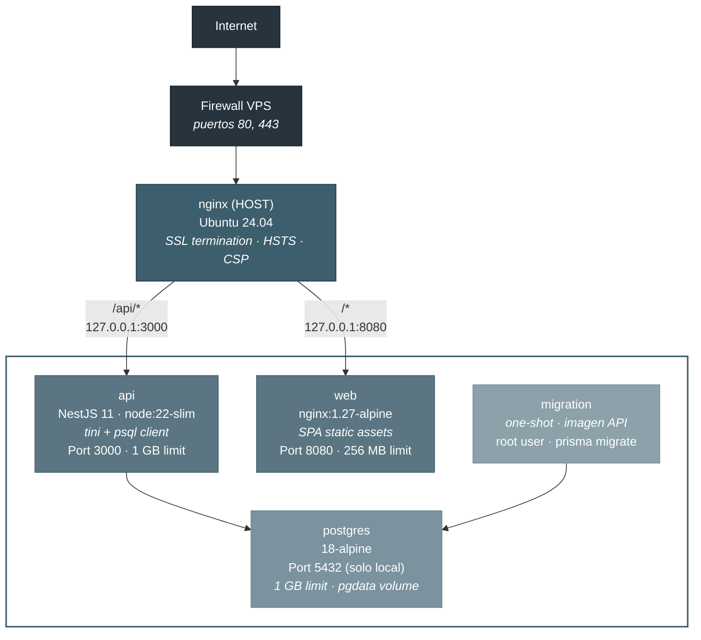
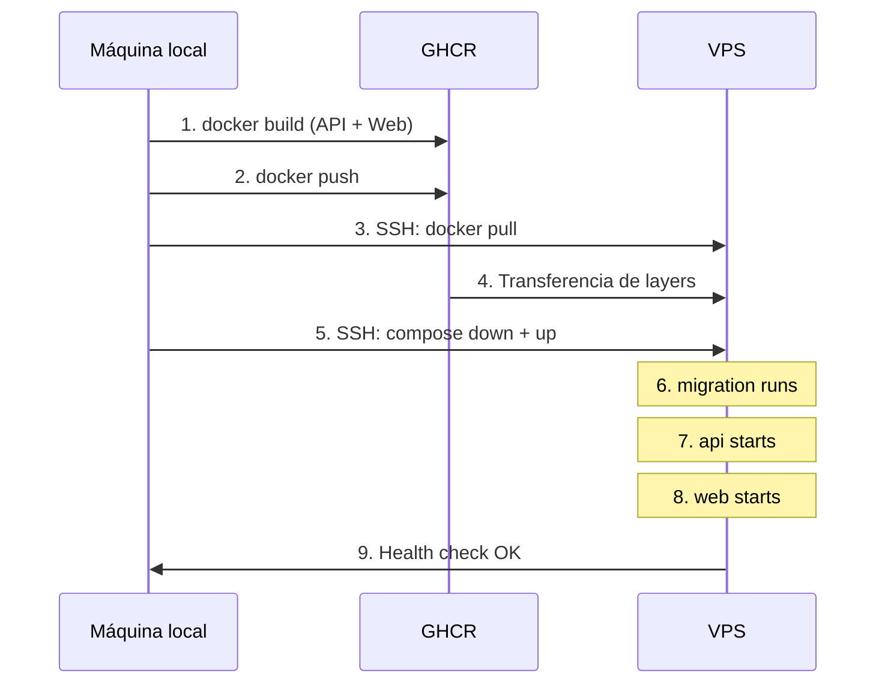

# 1. Arquitectura de Despliegue

<p align="center">
  <a href="README.md">← Índice</a> · 
  <a href="02-artifacts.md">2. Artefactos Generados →</a>
</p>

---

## Tabla de contenidos

- [Diagrama de arquitectura](#1-diagrama-de-arquitectura)
- [Decisiones de arquitectura](#2-decisiones-de-arquitectura)
- [Topología de red](#3-topología-de-red)
- [Modelo de seguridad](#4-modelo-de-seguridad)
- [Flujo de despliegue](#5-flujo-de-despliegue)
- [Límites de recursos](#6-límites-de-recursos)

---

## 1. Diagrama de arquitectura



### Flujo de una petición

**Rutas API** (`/api/*`):

1. El navegador solicita `https://associated.ipgsoft.com/api/v1/members`
2. nginx del host recibe en puerto 443, termina SSL
3. Detecta prefijo `/api/` y hace `proxy_pass` a `127.0.0.1:3000`
4. El contenedor `api` procesa la petición con NestJS
5. NestJS consulta PostgreSQL a través de la red Docker interna
6. La respuesta viaja el camino inverso, cifrada vía TLS al navegador

**Rutas SPA** (todo lo demás):

1. nginx del host hace `proxy_pass` a `127.0.0.1:8080`
2. El contenedor `web` (nginx interno) sirve los assets estáticos
3. Para rutas client-side, `try_files` cae a `/index.html` (SPA fallback)

---

## 2. Decisiones de arquitectura

### 2.1 nginx en el host vs. nginx en Docker

| Criterio                    |             nginx en host             |            nginx en Docker             |
| :-------------------------- | :-----------------------------------: | :------------------------------------: |
| Gestión de certificados SSL | Directa, sin volúmenes ni bind mounts |  Requiere montar certs como volúmenes  |
| Renovación certbot          |       Nativa con systemd timer        | Requiere contenedor adicional o script |
| Debugging                   |     Acceso directo a logs del SO      |         Requiere `docker logs`         |
| Complejidad                 |      Menor para un solo servicio      |           Mayor orquestación           |

**Decisión**: nginx en el **host** para terminación SSL. El certificado SSL es propio del usuario (no Let's Encrypt automatizado), y meterlo en Docker agrega complejidad innecesaria para un TFM. Certbot en el host puede renovar sin tocar contenedores.

### 2.2 GHCR vs. docker save/load

| Criterio       |               GHCR               |       docker save + scp        |
| :------------- | :------------------------------: | :----------------------------: |
| Transferencia  | Incremental (solo layers nuevos) | Completa (~300 MB+ por imagen) |
| Automatización |       `docker pull` nativo       |    scp + docker load manual    |
| Versionado     |    Tags inmutables por digest    |     Sin versionado nativo      |
| Costo          |  Gratis para repos públicos/org  |    Solo ancho de banda SSH     |
| Dependencia    |      Requiere GitHub y red       |        Funciona offline        |

**Decisión**: **GHCR** para distribución de imágenes. Las pulls incrementales ahorran tiempo y ancho de banda en cada despliegue. Solo se transfieren los layers que cambiaron. Para un TFM donde se hacen múltiples despliegues iterativos, la diferencia es significativa.

> [!NOTE]
> El usuario propuso inicialmente empaquetar imágenes como `.tar.gz` con `docker save` y subirlas vía `scp`. Se descartó porque cada despliegue transferiría ~500 MB+ completos, mientras que GHCR solo transfiere los layers modificados (~50–100 MB típicamente).

### 2.3 Contenedor one-shot para migraciones vs. migración en entrypoint

| Criterio                        |         One-shot container          |        Migración en entrypoint API        |
| :------------------------------ | :---------------------------------: | :---------------------------------------: |
| Separación de responsabilidades |         Clara: migra y sale         |       Mezcla arranque con migración       |
| Rollback                        | Independiente del ciclo de vida API | Si falla, API no arranca (o arranca rota) |
| Visibilidad                     |     Exit code explícito (0 o 1)     |         Log mezclado con arranque         |
| Permisos                        |       Puede correr como root        |         API debería ser non-root          |

**Decisión**: Contenedor **one-shot** (`migration`) que ejecuta `prisma migrate deploy` para la BD principal y luego itera todos los tenants vía `migrate-tenants.sh`. El contenedor API depende de que `migration` termine exitosamente (`condition: service_completed_successfully`).

### 2.4 Multi-servicio vs. contenedor único

| Criterio               | Multi-servicio (4 containers) |   Monolito (1 container)   |
| :--------------------- | :---------------------------: | :------------------------: |
| Escalado independiente |              Sí               |             No             |
| Aislamiento de fallos  |   Sí (web sigue si API cae)   |             No             |
| Uso de recursos        |   Controlable por servicio    |         Compartido         |
| Complejidad            |      Mayor orquestación       | Menor, pero menos flexible |

**Decisión**: **Multi-servicio** con 4 contenedores (postgres, migration, api, web). Cada componente tiene su propio ciclo de vida, límites de recursos y política de restart.

---

## 3. Topología de red

### Puertos expuestos

Todos los puertos de contenedores se bindean exclusivamente a `127.0.0.1`:

| Servicio     | Puerto contenedor |  Bind en host  | Accesible externamente |
| :----------- | :---------------: | :------------: | :--------------------: |
| postgres     |       5432        | 127.0.0.1:5432 |           NO           |
| api          |       3000        | 127.0.0.1:3000 |     NO (vía nginx)     |
| web          |       8080        | 127.0.0.1:8080 |     NO (vía nginx)     |
| nginx (host) |        80         |   0.0.0.0:80   |  SÍ (redirect a 443)   |
| nginx (host) |        443        |  0.0.0.0:443   |        SÍ (SSL)        |

> [!IMPORTANT]
> El patrón `127.0.0.1:PUERTO:PUERTO` en Docker Compose garantiza que los contenedores solo son accesibles desde el propio host. Sin el prefijo `127.0.0.1`, Docker expone el puerto en `0.0.0.0` (todas las interfaces), **saltándose el firewall del host**.

### Red Docker interna

Todos los contenedores comparten la red bridge `associated-net`. La comunicación entre contenedores se hace por nombre de servicio DNS:

- API conecta a `postgres:5432`
- Migration conecta a `postgres:5432`
- Web no necesita conectar a otros contenedores (solo sirve assets estáticos)

---

## 4. Modelo de seguridad

### 4.1 Principio de menor privilegio en contenedores

| Contenedor | Usuario            | `cap_drop` |                   `cap_add`                    | Justificación                                                                       |
| :--------- | :----------------- | :--------: | :--------------------------------------------: | :---------------------------------------------------------------------------------- |
| postgres   | postgres (interno) |    ALL     | CHOWN, FOWNER, SETGID, SETUID, DAC_READ_SEARCH | PostgreSQL necesita cambiar permisos de archivos en `pgdata` durante inicialización |
| migration  | root               |     -      |                       -                        | Necesita escribir en `node_modules/@prisma/engines` para ejecutar migraciones       |
| api        | appuser (UID 1001) |    ALL     |                   (ninguno)                    | No necesita ninguna capability. Máxima restricción                                  |
| web        | nginx (interno)    |    ALL     |             CHOWN, SETGID, SETUID              | nginx necesita cambiar ownership de archivos en su ciclo de arranque                |

Todos los contenedores tienen `security_opt: no-new-privileges:true`, que impide escalar privilegios vía `setuid` binaries.

### 4.2 SSL y cabeceras de seguridad

El vhost nginx del host implementa:

| Cabecera / Configuración | Valor                                              | Propósito                                  |
| :----------------------- | :------------------------------------------------- | :----------------------------------------- |
| TLS                      | 1.2 y 1.3 exclusivamente                           | Sin SSLv3, TLS 1.0, TLS 1.1                |
| HSTS                     | `max-age=63072000`, `includeSubDomains`, `preload` | Fuerza HTTPS durante 2 años                |
| X-Frame-Options          | `SAMEORIGIN`                                       | Protección contra clickjacking             |
| X-Content-Type-Options   | `nosniff`                                          | Previene MIME sniffing                     |
| X-XSS-Protection         | `1; mode=block`                                    | Filtro XSS del navegador                   |
| Referrer-Policy          | `strict-origin-when-cross-origin`                  | Control de referrer                        |
| Content-Security-Policy  | `default-src 'self'` (restrictiva)                 | Solo recursos del mismo origen             |
| Permissions-Policy       | Deniega cámara, micrófono y geolocalización        | Restricción de APIs del navegador          |
| OCSP Stapling            | Activo                                             | Verificación de revocación de certificados |

### 4.3 Cifrado de datos sensibles

En la capa de aplicación:

- **IBAN y DNI** se cifran con AES-256 usando `ENCRYPTION_KEY` (64 chars hex)
- **Contraseñas** se hashean con argon2 (nunca se almacenan en texto plano)
- **JWT** firmado con `JWT_SECRET` (mínimo 32 caracteres aleatorios)

### 4.4 Gestión de secretos

- Todos los secretos se almacenan en `.env` en el VPS (no en el repositorio)
- El archivo `.env.production.example` sirve como plantilla documentada
- Los secretos se generan con `openssl rand` para máxima entropía
- `POSTGRES_PASSWORD` y `JWT_SECRET` usan `-hex` para evitar caracteres especiales que rompan URLs o shells
- `ENCRYPTION_KEY` requiere exactamente 64 caracteres hexadecimales

### 4.5 Logging y rotación

Todos los contenedores usan el driver `json-file` con rotación:

```yaml
logging:
  driver: json-file
  options:
    max-size: '10m'
    max-file: '3'
```

Esto limita a 30 MB máximo de logs por servicio (3 archivos × 10 MB), evitando que el disco se llene por logs no controlados.

---

## 5. Flujo de despliegue



### Orden de arranque (dependency chain)


- `postgres` debe estar `healthy` (`pg_isready`) antes de que `migration` inicie
- `migration` debe completar exitosamente (exit code 0) antes de que `api` inicie
- `api` debe estar `healthy` (`GET /api/v1/health` 200) antes de que `web` inicie

---

## 6. Límites de recursos

| Servicio | Memoria máxima | Memoria reservada |
| :------- | :------------: | :---------------: |
| postgres |    1024 MB     |      256 MB       |
| api      |    1024 MB     |      256 MB       |
| web      |     256 MB     |       64 MB       |

PostgreSQL está configurado adicionalmente con:

| Parámetro              | Valor  |
| :--------------------- | :----: |
| `shared_buffers`       | 256 MB |
| `effective_cache_size` | 512 MB |
| `work_mem`             |  4 MB  |
| `maintenance_work_mem` | 64 MB  |
| `max_connections`      |  100   |

Total máximo: ~2,3 GB de los 8 GB disponibles en el VPS, dejando margen para el SO, nginx del host y operaciones.

---

<p align="center">
  <a href="README.md">← Índice</a> · 
  <a href="02-artifacts.md">2. Artefactos Generados →</a>
</p>
