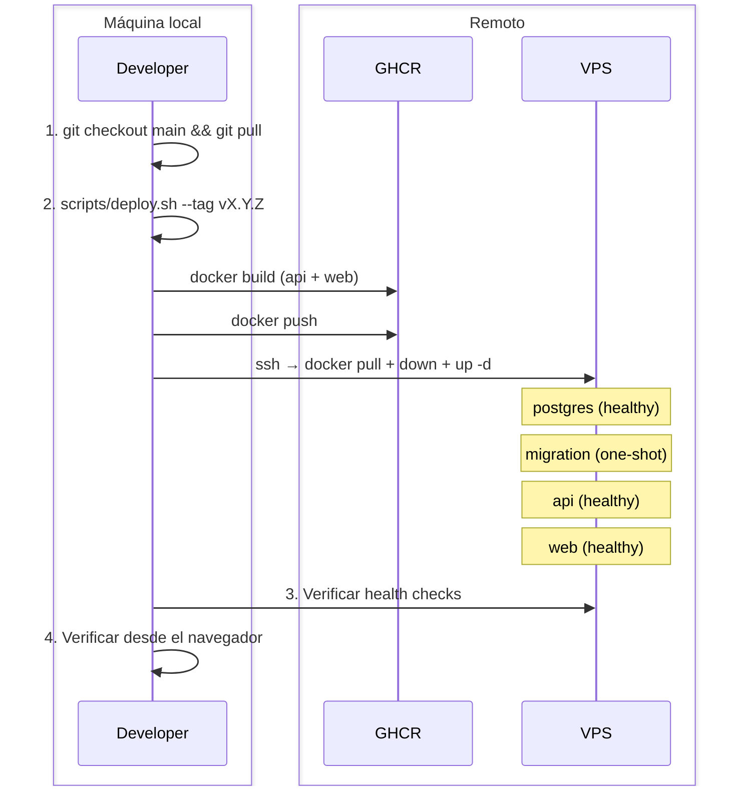

# 4. Deploy de nueva versión

<p align="center">
  <a href="03-initial-deploy.md">← 3. Guía de Primer Despliegue</a> · 
  <a href="README.md">↑ Índice</a> · 
  <a href="05-migration-guide.md">5. Guía de migraciones →</a>
</p>

---

Guía para desplegar una nueva versión de Associated después de cambios en el código. Cubre el flujo completo, deploys parciales (solo API o solo Web) y rollback.

## Tabla de contenidos

- [Flujo completo](#1-flujo-completo)
- [Paso a paso](#2-paso-a-paso)
- [Deploy solo API](#3-deploy-solo-api)
- [Deploy solo Web](#4-deploy-solo-web)
- [Rollback](#5-rollback)
- [Checklist de deploy](#checklist-de-deploy)

---

## 1. Flujo completo



---

## 2. Paso a paso

### 2.1 Asegurar que el código está en `main`

```bash
git checkout main
git pull origin main
```

Verificar que los tests pasan y el lint está limpio:

```bash
npm run lint
npm run -w api test:unit
npm run -w web test
```

### 2.2 Ejecutar deploy completo

Desde la raíz del repositorio, en tu máquina local:

```bash
VPS_HOST=vps-associated VPS_USER=deploy bash scripts/deploy.sh --tag v<VERSION>
```

Ejemplo:

```bash
VPS_HOST=vps-associated VPS_USER=deploy bash scripts/deploy.sh --tag v0.2.0
```

El script ejecuta 4 pasos:

| Paso | Acción                                                                      |
| :--: | :-------------------------------------------------------------------------- |
| 1/4  | Construye imágenes Docker (`api` + `web`) con el tag indicado               |
| 2/4  | Sube las imágenes a GHCR (`ghcr.io/appassociated-dev/associated-{api,web}`) |
| 3/4  | Se conecta al VPS por SSH, hace `pull` + `down` + `up -d`                   |
| 4/4  | Verifica health checks post-deploy                                          |

> [!NOTE]
> El script también taggea como `latest` automáticamente cuando usas un tag específico.

### 2.3 Si solo cambiaron archivos de compose/scripts

Si además del código cambiaron `docker-compose.prod.yml`, scripts, o `init.sql`, copia los archivos actualizados al VPS **antes** de ejecutar el deploy:

```bash
# Copiar compose actualizado
scp docker-compose.prod.yml vps-associated:/opt/associated/

# Copiar scripts actualizados
scp scripts/*.sh vps-associated:/opt/associated/scripts/
ssh vps-associated "chmod +x /opt/associated/scripts/*.sh"

# Copiar init.sql si cambió
scp docker/postgres/init.sql vps-associated:/opt/associated/docker/postgres/
```

Luego ejecutar el deploy normalmente.

### 2.4 Verificar el deploy

```bash
# Estado de contenedores
ssh vps-associated "cd /opt/associated && docker compose -f docker-compose.prod.yml ps"

# Health API
curl -s https://associated.ipgsoft.com/api/v1/health | jq .

# Health Web
curl -I https://associated.ipgsoft.com/
```

---

## 3. Deploy solo API

Cuando solo cambió el backend (código en `api/`):

### 3.1 Construir y subir solo la imagen API

```bash
# Construir
docker build -f api/Dockerfile.prod -t ghcr.io/appassociated-dev/associated-api:v<VERSION> .
docker tag ghcr.io/appassociated-dev/associated-api:v<VERSION> ghcr.io/appassociated-dev/associated-api:latest

# Subir
docker push ghcr.io/appassociated-dev/associated-api:v<VERSION>
docker push ghcr.io/appassociated-dev/associated-api:latest
```

### 3.2 Actualizar solo el servicio API en el VPS

```bash
ssh vps-associated bash -s << 'EOF'
cd /opt/associated
docker compose -f docker-compose.prod.yml pull api
docker compose -f docker-compose.prod.yml up -d api
EOF
```

### 3.3 Si hay migraciones pendientes

Ejecutar el contenedor de migración antes de reiniciar la API:

```bash
ssh vps-associated bash -s << 'EOF'
cd /opt/associated
docker compose -f docker-compose.prod.yml pull api
docker compose -f docker-compose.prod.yml run --rm migration
docker compose -f docker-compose.prod.yml up -d api
EOF
```

### 3.4 Verificar

```bash
curl -s https://associated.ipgsoft.com/api/v1/health | jq .
```

---

## 4. Deploy solo Web

Cuando solo cambió el frontend (código en `web/`):

### 4.1 Construir y subir solo la imagen Web

```bash
# Construir
docker build -f web/Dockerfile.prod -t ghcr.io/appassociated-dev/associated-web:v<VERSION> .
docker tag ghcr.io/appassociated-dev/associated-web:v<VERSION> ghcr.io/appassociated-dev/associated-web:latest

# Subir
docker push ghcr.io/appassociated-dev/associated-web:v<VERSION>
docker push ghcr.io/appassociated-dev/associated-web:latest
```

### 4.2 Actualizar solo el servicio Web en el VPS

```bash
ssh vps-associated bash -s << 'EOF'
cd /opt/associated
docker compose -f docker-compose.prod.yml pull web
docker compose -f docker-compose.prod.yml up -d web
EOF
```

### 4.3 Verificar

```bash
curl -I https://associated.ipgsoft.com/
# Esperado: HTTP/2 200
```

> [!NOTE]
> Si los usuarios tienen la SPA cacheada, van a necesitar hacer un hard refresh (Ctrl+Shift+R) para ver los cambios. Los assets con hash de Vite (en `/assets/`) se invalidan automáticamente.

---

## 5. Rollback

El rollback consiste en volver a una versión anterior usando el tag de imagen Docker.

### 5.1 Identificar la versión a restaurar

```bash
# Listar tags de la imagen API
docker image ls ghcr.io/appassociated-dev/associated-api --format "{{.Tag}}"

# O desde GitHub (requiere gh CLI)
gh api /orgs/appassociated-dev/packages/container/associated-api/versions \
  --jq '.[].metadata.container.tags[]' | sort -V
```

### 5.2 Rollback completo

```bash
ssh vps-associated bash -s << 'ROLLBACK'
cd /opt/associated

# Detener servicios
docker compose -f docker-compose.prod.yml down

# Forzar pull de la versión anterior
docker pull ghcr.io/appassociated-dev/associated-api:v<VERSION_ANTERIOR>
docker pull ghcr.io/appassociated-dev/associated-web:v<VERSION_ANTERIOR>

# Re-taggear como latest
docker tag ghcr.io/appassociated-dev/associated-api:v<VERSION_ANTERIOR> ghcr.io/appassociated-dev/associated-api:latest
docker tag ghcr.io/appassociated-dev/associated-web:v<VERSION_ANTERIOR> ghcr.io/appassociated-dev/associated-web:latest

# Levantar con la versión anterior
docker compose -f docker-compose.prod.yml --env-file .env up -d

# Verificar
sleep 15
docker compose -f docker-compose.prod.yml ps
ROLLBACK
```

### 5.3 Rollback solo API

```bash
ssh vps-associated bash -s << 'ROLLBACK'
cd /opt/associated
docker pull ghcr.io/appassociated-dev/associated-api:v<VERSION_ANTERIOR>
docker tag ghcr.io/appassociated-dev/associated-api:v<VERSION_ANTERIOR> ghcr.io/appassociated-dev/associated-api:latest
docker compose -f docker-compose.prod.yml up -d api
ROLLBACK
```

### 5.4 Rollback solo Web

```bash
ssh vps-associated bash -s << 'ROLLBACK'
cd /opt/associated
docker pull ghcr.io/appassociated-dev/associated-web:v<VERSION_ANTERIOR>
docker tag ghcr.io/appassociated-dev/associated-web:v<VERSION_ANTERIOR> ghcr.io/appassociated-dev/associated-web:latest
docker compose -f docker-compose.prod.yml up -d web
ROLLBACK
```

### 5.5 Consideraciones sobre migraciones en rollback

> [!IMPORTANT]
> Si la versión nueva incluía migraciones de base de datos que ya se ejecutaron, el rollback del código **no revierte las migraciones**. Prisma no tiene un mecanismo automático de rollback de migraciones.
>
> Si necesitas revertir una migración:
>
> 1. Crear una nueva migración que deshaga los cambios (enfoque recomendado)
> 2. O restaurar un backup de la base de datos (ver [06 - Troubleshooting](06-troubleshooting.md))

---

## Checklist de deploy

Usar esta lista antes de cada deploy a producción:

- [ ] Código mergeado a `main`
- [ ] Tests unitarios pasan (`npm run -w api test:unit`, `npm run -w web test`)
- [ ] Lint limpio (`npm run lint`)
- [ ] Si hay migraciones nuevas, verificadas en desarrollo
- [ ] Tag de versión definido (semver: `vX.Y.Z`)
- [ ] Deploy ejecutado con `scripts/deploy.sh --tag vX.Y.Z`
- [ ] Health checks pasan (`/api/v1/health`, HTTPS `200`)
- [ ] Aislamiento de puertos verificado (5432 y 3000 no accesibles externamente)
- [ ] Login funciona desde el navegador

---

<p align="center">
  <a href="03-initial-deploy.md">← 3. Guía de Primer Despliegue</a> · 
  <a href="README.md">↑ Índice</a> · 
  <a href="05-migration-guide.md">5. Guía de migraciones →</a>
</p>
