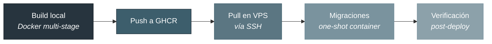

# Documentación de Despliegue

**Associated - ERP ligero para colectividades españolas**


> **Dominio**: domain-deploy.com
> **Repositorio**: [appassociated-dev/tfm-associated](https://github.com/appassociated-dev/tfm-associated)
> **Registry**: `ghcr.io/appassociated-dev/associated-{api,web}`

---

## Tabla de contenidos

- [Índice de documentos](#índice-de-documentos)
- [Estrategia de despliegue](#estrategia-de-despliegue)
- [Referencia rápida](#referencia-rápida)
- [Stack tecnológico del despliegue](#stack-tecnológico-del-despliegue)

---

## Índice de documentos

| #   | Documento                                                 | Contenido                                                          |
| :-- | :-------------------------------------------------------- | :----------------------------------------------------------------- |
| 1   | [Arquitectura de Despliegue](01-architecture.md)          | Arquitectura, decisiones, topología de red, modelo de seguridad    |
| 2   | [Artefactos Generados](02-artifacts.md)                   | Detalle de los 14 artefactos: Dockerfiles, compose, nginx, scripts |
| 3   | [Guía de Primer Despliegue](03-initial-deploy.md)         | Guía paso a paso del primer despliegue en el VPS                   |
| 4   | [Deploy de nueva versión](04-new-version-deploy.md)       | Despliegue de nuevas versiones, deploys parciales y rollback       |
| 5   | [Guía de migraciones](05-migration-guide.md)              | Crear, ejecutar y recuperar migraciones Prisma multi-tenant        |
| 6   | [Troubleshooting](06-troubleshooting.md)                  | Resolución de problemas con mensajes de error y soluciones         |
| 7   | [Referencia rápida de comandos](07-commands-reference.md) | Referencia completa de comandos útiles                             |

---

## Estrategia de despliegue

Associated se despliega mediante un flujo manual basado en scripts:



El flujo completo se ejecuta con un único comando:

```bash
./scripts/deploy.sh --tag v1.0.0
```

---

## Referencia rápida

### URLs

| Servicio                | URL                                        |
| :---------------------- | :----------------------------------------- |
| Aplicación (HTTPS)      | `https://domain-deploy.com`                |
| API (a través de nginx) | `https://domain-deploy.com/api/v1/`        |
| Health check API        | `https://domain-deploy.com/api/v1/health`  |
| GHCR API                | `ghcr.io/appassociated-dev/associated-api` |
| GHCR Web                | `ghcr.io/appassociated-dev/associated-web` |

### Acceso al VPS

```bash
# Conexión SSH (configurada en ~/.ssh/config como vps-associated)
ssh vps-associated

# O directamente
ssh deploy@<IP_VPS> -i ~/.ssh/id_ed25519.associated
```

### Ubicación de archivos en el VPS

| Ruta                                         | Contenido                                     |
| :------------------------------------------- | :-------------------------------------------- |
| `/opt/associated/`                           | Directorio de trabajo: compose, .env, scripts |
| `/opt/associated/.env`                       | Variables de entorno de producción            |
| `/opt/associated/docker-compose.prod.yml`    | Compose de producción                         |
| `/etc/nginx/sites-available/associated.conf` | Vhost nginx del host                          |
| `/etc/ssl/associated/`                       | Certificados SSL                              |

### Comandos frecuentes

```bash
# --- Despliegue ---
./scripts/deploy.sh                      # Deploy con tag latest
./scripts/deploy.sh --tag v1.0.0         # Deploy con tag específico
./scripts/deploy.sh --build-only         # Solo build + push, sin deploy

# --- En el VPS ---
cd /opt/associated

# Estado de servicios
docker compose -f docker-compose.prod.yml ps

# Logs en tiempo real
docker compose -f docker-compose.prod.yml logs -f
docker compose -f docker-compose.prod.yml logs -f api    # Solo API

# Reiniciar todo
docker compose -f docker-compose.prod.yml down
docker compose -f docker-compose.prod.yml --env-file .env up -d

# Verificar health
curl http://127.0.0.1:3000/api/v1/health
curl http://127.0.0.1:8080/healthz

# --- Verificación automatizada ---
./scripts/verify-deploy.sh               # Todas las verificaciones
./scripts/verify-deploy.sh --check 6.3   # Solo aislamiento de puertos

# --- Seed de datos ---
API_URL=https://domain-deploy.com/api \
SUPERADMIN_API_KEY=xxx \
ADMIN_EMAIL=admin@example.com \
ADMIN_PASSWORD=xxx \
bash scripts/seed-production.sh
```

### Generación de secretos

```bash
# Password de PostgreSQL (hex, sin caracteres especiales)
openssl rand -hex 24

# JWT Secret
openssl rand -base64 48

# Clave de cifrado AES-256 (exactamente 64 caracteres hex)
openssl rand -hex 32

# API Key de superadmin
openssl rand -base64 32
```

---

## Stack tecnológico del despliegue

| Componente          | Tecnología                |            Versión            |
| :------------------ | :------------------------ | :---------------------------: |
| Contenedores        | Docker + Docker Compose   |             29.x              |
| Base de datos       | PostgreSQL                |           18-alpine           |
| Backend             | Node.js + NestJS          |           22 / 11.x           |
| Frontend            | nginx (en contenedor)     |          1.27-alpine          |
| Reverse proxy + SSL | nginx (en host)           |      1.24 (Ubuntu 24.04)      |
| Registry            | GitHub Container Registry |               -               |
| ORM + Migraciones   | Prisma                    |              7.x              |
| Proceso init        | Tini                      |               -               |
| VPS                 | IONOS DCD (Ubuntu 24.04)  | 4 cores, 8 GB RAM, 240 GB SSD |

---

<p align="center">
  <a href="01-architecture.md">1. Arquitectura de Despliegue →</a>
</p>
